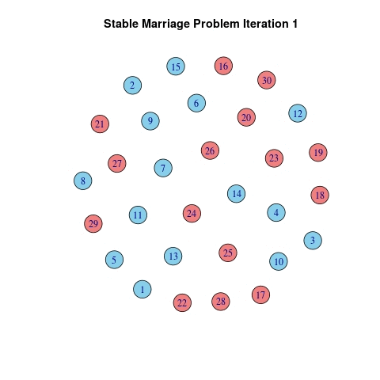

# Stable Marriage Problem

This repository contains an R script to generate data for the stable marriage problem as an igraph network object, compute a solution to the graph and visualize the process and results. It's inspired by a numberphile video (https://www.youtube.com/watch?v=Qcv1IqHWAzg) and only a just for fun project.

## Example

### Starting Point

### Preference List

	
|   |V1 V2  V3  V4  V5  V6  V7  V8  V9 V10 V11 V12  V13 V14 V15|
|1  |30	18	29	25	17	21	20	19	27	22	16	26	28	23	24|
|2  |18	26	24	27	28	29	30	23	17	22	16	21	25	19	20|
|3  |16	26	22	20	25	28	24	30	17	18	19	23	21	27	29|
|4  |21	24	17	20	23	28	16	29	18	26	27	22	30	19	25|
|5  |27	19	21	26	23	28	25	22	30	16	17	24	20	18	29|
|6  |20	21	18	24	19	29	27	23	25	16	28	26	17	30	22|
|7  |24	29	18	22	28	27	21	17	25	20	30	19	26	23	16|
|8  |25	27	17	30	21	19	16	26	23	22	18	29	28	24	20|
|9  |30	23	16	22	26	27	25	17	21	24	18	29	28	19	20|
|10	|23	20	22	26	19	18	24	28	21	17	16	25	30	27	29|
|11	|18	23	19	22	28	16	29	21	24	26	25	27	17	20	30|
|12	|19	23	18	30	27	21	16	17	28	26	22	24	20	29	25|
|13	|20	28	17	26	21	24	23	19	29	25	30	16	22	27	18|
|14	|22	28	16	23	27	25	24	26	17	20	21	29	18	19	30|
|15	|28	27	25	23	21	22	16	24	20	30	18	17	29	19	26|
|16	|11	15	9	4	10	7	13	14	2	12	5	6	1	3	8|
|17	|5	7	6	11	1	10	12	2	9	15	8	3	14	4	13|
|18	|5	10	9	4	6	2	1	8	15	13	12	3	11	14	7|
|19	|2	4	10	1	5	11	9	8	7	12	13	6	15	3	14|
|20	|6	7	13	9	1	5	10	8	12	4	2	11	15	3	14|
|21	|1	2	13	8	15	3	14	9	5	4	11	7	12	6	10|
|22	|10	15	6	12	3	4	11	5	7	9	2	13	14	1	8|
|23	|13	7	9	4	2	6	15	12	5	14	3	10	1	8	11|
|24	|1	3	12	2	5	15	14	6	10	13	9	11	7	8	4|
|25	|1	6	10	8	13	11	4	14	9	5	7	2	15	12	3|
|26	|7	10	1	2	8	3	15	14	13	4	12	11	9	6	5|
|27	|14	3	6	10	5	4	2	1	12	8	7	13	9	15	11|
|28	|15	3	5	6	10	14	11	12	1	7	9	4	8	2	13|
|29	|8	12	7	2	1	4	9	5	3	10	14	11	6	15	13|
|30	|10	15	9	11	7	6	3	13	8	14	4	5	12	2	1|

### Solution

### Results

